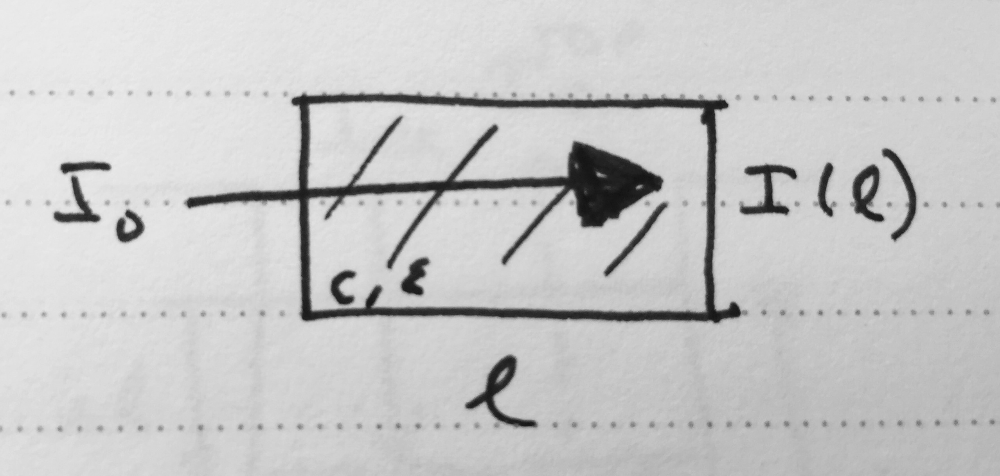
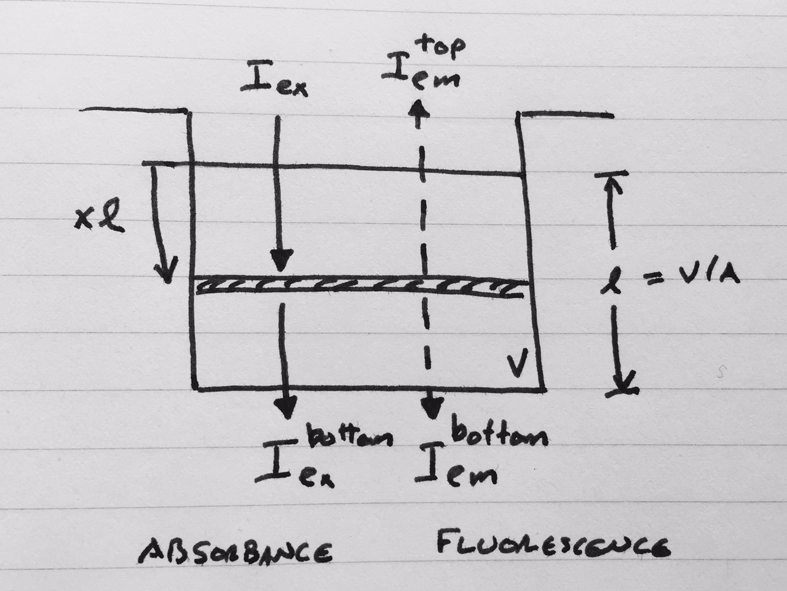

.. _theory:

******
Theory
******

This section describes the theory behind the various Bayesian model fitting schemes in `AssayTools`.

Bayesian analysis
=================

`AssayTools` uses `Bayesian inference <https://en.wikipedia.org/wiki/Bayesian_inference>`_ to infer unknown parameters (such as ligand binding free energies) from experimental spectroscopic data.
It does this to allow the complete uncertainty---in the form of the joint distribution of all unknown parameters---to be rigorously characterized.
The most common way to summarize these results is generally to extract confidence intervals of individual parameters, but much more sophisticated analyses---such as examining the correlation between parameters---are also possible.

The Bayesian analysis scheme is intended to be modular, and the user can select whether certain effects (such as :ref:`inner filter effects <inner-filter-effects>`) are incorporated into the model.
Below, we describe the components of the model.
If an effect that carries unknown nuisance parameters (such as extinction coefficients for :ref:`inner filter effects <inner-filter-effects>`), these nuisance parameters carry additional prior terms along with them and are inferred as part of the inference procedure.

Unknown parameters
------------------
.. _parameters:

For convenience, we define the unknown parameters in the model for reference:

* the *true total ligand concentration* :math:`L_{true}` in the well (including all species involving the ligand)
* the *true receptor concentration* :math:`R_{true}` (including all species involving the receptor)

Data
----
.. _data:

For each experiment, the data is given by a set of observations for each well.
Each well is associated with some properties:

* the *volume* :math:`V` of sample in the well (mostly buffer)
* a total concentration :math:`[R]_T` of *receptor* added to the well
* a total concentration :math:`[L]_T` of *ligand* added to the well (or potentially multiple ligands)
* the *well area* :math:`A` with the assumption that the well is cylindrical (allowing the path length :math:`l` to be computed)

and one or more experimental measurements:

* a *top fluorescence measurement* (returning toward the incident excitation light) :math:`F_{top}`
* a *bottom fluorescence measurement* (proceeding in the same direction as the incident excitation light) :math:`F_{bottom}`
* an *absorbance measurement* :math:`A`

Priors
------
.. _priors:

Each unknown parameter in the model is assigned a *prior* distribution that reflects the state of knowledge we have of its value before including the effects of the observed data.

Concentrations
^^^^^^^^^^^^^^
.. _concentrations:

While we design the experiment to dispense the *intended* amount of protein and ligand into each well, the true amount dispensed into the well will vary due to random pipetting error.
The *true* concentrations of protein :math:`R_{true}` and ligand :math:`L_{true}` in each well are therefore unknown.
Because we propagate the pipetting error along with the intended concentrations, we have the intended ("stated") protein concentration :math:`P_{stated}` and its standard error :math:`\delta P_{stated}` as input.
Similarly, the stated ligand concentration :math:`L_{stated}` and its error :math:`\delta L_{stated}` are also known.

If we assume the dispensing process is free of bias, the simplest distribution that fits the stated concentration and its standard deviation without making additional assumptions is a Gaussian.

We assign these true concentrations for the receptor :math:`R_{true}` and ligand :math:`L_{true}` a prior distribution.
If ``concentration_priors`` is set to ``gaussian``, this is precisely what is used

.. math::

   R_{true} &\sim N(R_{stated}, \delta R_{stated}) \\
   L_{true} &\sim N(L_{stated}, \delta L_{stated}) \\

This is expressed in the :mod:`pymc` model as ::

  Ptrue = pymc.Normal('Ptrue', mu=Pstated, tau=dPstated**(-2)) # protein concentration (M)
  Ltrue = pymc.Normal('Ltrue', mu=Lstated, tau=dLstated**(-2)) # ligand concentration (M)

.. note:: :mod:`pymc` uses the *precision* :math:`\tau \equiv \sigma^{-2}` instead of the variance :math:`\sigma^2` as a parameter of the normal distribution.

Gaussian priors have the unfortunate drawback that there is a small but nonzero probability that these concentrations would be negative, leading to nonsensical (unphysical) concentrations.
To avoid this, we generally use a lognormal distribution (selected by ``concentration_priors='lognormal'``).
The lognormal priors are expressed in the :mod:`pymc` model as ::

  Ptrue = pymc.Lognormal('Ptrue', mu=np.log(Pstated**2 / np.sqrt(dPstated**2 + Pstated**2)), tau=np.sqrt(np.log(1.0 + (dPstated/Pstated)**2))**(-2)) # protein concentration (M)
  Ltrue = pymc.Lognormal('Ltrue', mu=np.log(Lstated**2 / np.sqrt(dLstated**2 + Lstated**2)), tau=np.sqrt(np.log(1.0 + (dLstated/Lstated)**2))**(-2)) # ligand concentration (M)

.. note:: The parameters of a *lognormal distribution* differ from those of a normal distribution by the relationship `described here <https://en.wikipedia.org/wiki/Log-normal_distribution>`_. The parameters above ensure that the mean concentration is the stated concentration and the standard deviation is its experimental uncertainty.  The relationship between the mean and variance of the normal distribution :math:`\mu_N, \sigma_N^2` and the parameters for the lognormal distribution is given by:
.. math::

   \mu_{LN} = \ln \frac{\mu_N^2}{\sqrt{\mu_N^2 + \sigma_N^2}} \:\:;\:\: \sigma^2_{LN} = \ln \left[ 1 + \left( \frac{\sigma_N}{\mu_N}\right)^2 \right] \:\:;\:\: \tau_{LN} = \ln \left[ 1 + \left( \frac{\sigma_N}{\mu_N}\right)^2 \right]^{-1}

Binding free energy
^^^^^^^^^^^^^^^^^^^
.. _binding-free-energy:

The ligand binding free energy :math:`\Delta G` is unknown, and presumed to either be unknown over a large uniform range with the ``uniform`` prior

.. math::

   \Delta G \sim U(-\Delta G_\mathrm{min}, +\Delta G_\mathrm{max})

where we by default take :math:`\Delta G_\mathrm{min} = \ln 10^{-15}` (femtomolar affinity) and `\Delta G_\mathrm{max} = 0` (molar affinity), where :math:`\Delta G` is in units of thermal energy :math:`k_B T`.

This is expressed in the :mod:`pymc` model as ::

  DeltaG = pymc.Uniform('DeltaG', lower=DG_min, upper=DG_max) # binding free energy (kT), uniform over huge range

This uniform prior has the drawback that affinities near the extreme measurable ranges are simply unknown with equal likelihood out to absurd extreme values.

We can attenuate the posterior probabilities at extreme affinities by using a prior inspired by the range of data recorded in `ChEMBL <https://www.ebi.ac.uk/chembl/>`_ via the ``chembl`` prior, with a Gaussian form

.. math::

   \Delta G &\sim N(0, \sigma^2) \\
   \sigma &= 12.5 \: \mathrm{kcal/mol}

This is expressed in the :mod:`pymc` model as ::

  DeltaG = pymc.Normal('DeltaG', mu=0, tau=1./(12.5**2)) # binding free energy (kT), using a Gaussian prior inspired by ChEMBL

Modular components of the Bayesian model
----------------------------------------

We now discuss the various modular components of the Bayesian inference scheme.

These components generally involve models of observed spectroscopic value that are computed from concentrations of the various components :math:`[X_i]` which represent, for example, free receptor :math:`R`, complexed receptor :math:`RL`, or free ligand :math:`L`.
These concentrations are computed from the current samples of true total concentrations and binding affinities using one of the specified :ref:`binding models <binding-models>` described below.

Fluorescence
^^^^^^^^^^^^
.. _fluorescence:

Fluorescence model
""""""""""""""""""
.. _fluorescence-model:

Fluorescence can be measured from either the top, bottom, or both.
The true fluorescence depends on the concentration of each species :math:`X_i`:

.. math::

   F_\mathrm{top} = I_{ex} \left[ \sum_{i} q_i(ex,em) [X_i] + l F_\mathrm{buffer} + F_\mathrm{plate} \right]

   F_\mathrm{bottom} = G_\mathrm{bottom} \cdot I_{ex} \left[ \sum_{i} q_i(ex,em) [X_i] + l F_\mathrm{buffer} + F_\mathrm{plate} \right]

Here, :math:`I_{ex}` is the incident excitation intensity, :math:`q_i(ex,em)` are the quantum efficiencies of each species at the excitation/emission wavelengths, :math:`F_\mathrm{buffer}` is a buffer fluorescence per unit path length, and :math:`F_\mathrm{plate}` is the background fluorescence of the plate.
Notably, without :ref:`inner filter effects <inner-filter-effects>`, the only factor that causes differences between top and bottom fluorescence is the gain factor `G_\mathrm{bottom}` that captures a potential difference in detector gains between the top and bottom detectors.

Observed fluorescence
"""""""""""""""""""""
.. _observed-fluorescence:

The observed fluorescence :math:`F^\mathrm{obs}_\mathrm{top}` and :math:`F^\mathrm{obs}_\mathrm{bottom}` will differ from the true fluorescence due to detector noise.
Because the observed fluorescence is reported as the mean of a number of detector measurements from independent flashes of the Xenon lamp, detector error will be well described by a normal distribution:

.. math::

   F^\mathrm{obs}_\mathrm{top} &\sim N(f_\mathrm{top}, \sigma_\mathrm{top}^2) \\
   F^\mathrm{obs}_\mathrm{bottom} &\sim N(f_\mathrm{top}, \sigma_\mathrm{bottom}^2)

The measurement errors :math:`\sigma_\mathrm{top}` and :math:`\sigma_\mathrm{bottom}` are assigned Jeffreys priors, which are uniform in :math:`\ln \sigma`

.. math::

   \ln \sigma &\sim U(-10, \ln F_{max})

By default, the same detector error :math:`\sigma` is used for both top and bottom detectors, but separate errors can be used if ``link_top_and_bottom_sigma = False``.

While the detector error is inferred separately for each experiment since the detector gain may differ from experiment.
If multiple datasets using the same instrument configuration and detector gain are inferred together---such as the inclusion of calibration experiments with controls---this will help improve the detector error estimate.

Quantum efficiencies
""""""""""""""""""""
.. _quantum-efficiencies:

Since the quantum efficiencies :math:`q_i(ex,em)` of each species :math:`X_i` are unknown, they are inferred as `nuisance parameters <https://en.wikipedia.org/wiki/Nuisance_parameter>`_ as part of the Bayesian inference process.
We therefore assign a uniform (informationless) priors to these, though we use the product :math:`F_i \equiv I_{ex} q_i(ex,em)` for convenience since :math:`I_{ex}` and the scaling factor to convert observed fluorescence into reported arbitrary fluorescence units is unknown:

.. math::

   F_i &\sim U(0, F_{i,{max}}) \\
   F_\mathrm{plate} &\sim U(0, F_\mathrm{max}) \\
   F_\mathrm{buffer} &\sim U(0, F_\mathrm{max}/l)

For efficiency, we compute the maximum allowed values based on an upper limit of these quantities from the observed data.

We also make efficient initial guesses for these quantities, which assume that:

* :math:`F_\mathrm{buffer}` assumes the minimum fluorescence signal is explained by only buffer fluorescence
* :math:`F_\mathrm{plate}` assumes the minimum fluorescence signal is explained by only plate fluorescence
* :math:`F_L` assumes the maximum fluorescence signal increase above background is explained by the free ligand fluorescence
* :math:`F_R` assumes the receptor fluorescence is zero
* :math:`F_{PL}` assumes that the maximum fluorescence signal increase above background is explained by complex fluorescence with 100% complex formation

These assumptions can of course be violated once the sampler starts to infer these quantities.

In the :mod:`pymc` model, these priors are implemented via ::

  model['F_PL'] = pymc.Uniform('F_PL', lower=0.0, upper=2*Fmax/min(Pstated.max(),Lstated.max()), value=F_PL_guess) # complex fluorescence
  model['F_P'] = pymc.Uniform('F_P', lower=0.0, upper=2*(Fmax/Pstated).max(), value=F_P_guess) # protein fluorescence
  model['F_L'] = pymc.Uniform('F_L', lower=0.0, upper=2*(Fmax/Lstated).max(), value=F_L_guess) # ligand fluorescence
  model['F_plate'] = pymc.Uniform('F_plate', lower=0.0, upper=Fmax, value=F_plate_guess) # plate fluorescence
  model['F_buffer'] = pymc.Uniform('F_buffer', lower=0.0, upper=Fmax/path_length, value=F_buffer_guess) # buffer fluorescence

Top/bottom detector gain
""""""""""""""""""""""""
.. _detector-gain:

The bottom detector relative gain factor is assigned a uniform prior over the log gain:

.. math::

   \ln G_\mathrm{bottom} \sim U(-6, +6)

which is implemented in the :mod:`pymc` model as ::

  model['log_gain_bottom'] = pymc.Uniform('log_gain_bottom', lower=-6.0, upper=6.0, value=log_gain_guess) # plate material absorbance at emission wavelength
  model['gain_bottom'] = pymc.Lambda('gain_bottom', lambda log_gain_bottom=model['log_gain_bottom'] : np.exp(log_gain_bottom) )

Absorbance
^^^^^^^^^^
.. _absorbance:

Absorbance model
""""""""""""""""
.. _absorbance-model:

The absorbance is determined by the the extinction coefficient of each component :math:`X_i` (`R`, `L`, `RL` for simple two-component binding) at the illumination wavelength, as well as any intrinsic absorbance of the plate at that wavelength.

.. math::

   A &= 1 - e^{-\epsilon \cdot l \cdot [L]}

where :math:`\epsilon` is the extinction coefficient of the species (e.g. free ligand :math:`L`) at the illumination wavelength (excitation or emission), :math:`l` is the path length, and :math:`c` is the concentration of the species.

.. note:: You may be more familiar with the linearized form of Beer's law (:math:`A = \epsilon l c`). It's easy to see that this comes from a Taylor expansion of the above equation, truncated to first order: :math:`1 - e^{-\epsilon l c} \approx 1 - \left[ 1 - \epsilon l c + \mathcal{O}(\epsilon l c)^2) \right] \approx \epsilon l c`. We use the equation above instead because it is much more accurate for larger absorbance values.

The plate absorbance is a nuisance parameter that is assigned a uniform informationless prior:

.. math::

   A_\mathrm{plate} \sim U(0,1)

Currently, ``AssayTools`` supports absorbance measurements made at either (or both) the excitation and emission wavelengths.
Absorbance measurements performed at the excitation wavelength help constrain the extinction coefficient for :ref:`primary inner filter effects <primary-inner-filter-effect>`, while absorbance measurements at the emission wavelength help constrain the extinction coefficients for :ref:`secondary inner filter effects <secondary-inner-filter-effect>`.
Note that even if plates that are not highly transparent in the excitation or emission wavelengths are used, this still provides useful information---this effect is corrected for by inferring the plate absorbance :math:`A_\mathrm{plate}` at the appropriate wavelengths.

.. note:: Currently, ``AssayTools`` only models absorbance for the ligand, using data from wells in which only ligand in buffer is present. In the future, we intend to extend this to support absorbance of all components.

Observed absorbance
"""""""""""""""""""
.. _observed-absorbance:

As the detector averages many measurements from multiple flashes of a Xenon lamp for the reported absorbance :math:`A^\mathrm{obs}`, the observed measurement can be modeled with a normal distribution

.. math::

   A^\mathrm{obs} \sim N(A, \sigma_\mathrm{abs}^2)

The detector error :math:`\sigma_A` is assigned Jeffreys priors, which are uniform in :math:`\ln \sigma_\mathrm{abs}`

.. math::

   \ln \sigma_\mathrm{abs} &\sim U(-10, 0)

.. note:: It is critical that if multiple datasets are inferred jointly, they all be from the same plate type.

Inner filter effects
^^^^^^^^^^^^^^^^^^^^
.. _inner-filter-effects:

.. todo:: Need to add useful references to this section.

Primary inner filter effect
"""""""""""""""""""""""""""
.. _primary-inner-filter-effect:

At high ligand concentrations, if the ligand has significant absorbance at the excitation wavelength, the amount of light reaching the bottom of the well is less than the light reaching the top of the well.
This is called the *primary inner filter effect*, and has the net effect of attenuating the observed absorbance and fluorescence.

To see where this effect comes from, consider the permeation of light through a liquid with molar concentration :math:`c`, and extinction coefficient :math:`\epsilon`.

   Attenuation of light passing through a liquid containing absorbing species.

A slice of width :math:`\Delta l` at depth :math:`l` will absorb some of the incoming light intensity :math:`I(l)`:

.. math::

   \Delta I = - \epsilon \cdot \Delta l \cdot c \cdot I(l)

If we shrink :math:`\Delta l` down to an infinitesimal slice, this gives us a differential equation for the intensity :math:`I(l)` at depth :math:`l`:

.. math::

   \frac{\partial I(l)}{\partial l} = - \epsilon \cdot c \cdot I(l)

It's easy to see that the solution to this differential equation is given by

.. math::

   I(l) = I_0 e^{-\epsilon l c}

since this satisfies the differential equation:

.. math::

   \frac{\partial I(l)}{\partial l} = I_0 (-\epsilon c) e^{-\epsilon l c} = - \epsilon \cdot c \cdot I(l)

If only the primary inner filter effect is used, both top and bottom fluorescence are attenuated by a factor that can be computed by integrating the attenuation of incident light over the whole liquid path length:

.. math::

   \mathrm{IF}_\mathrm{top/bottom} = \int_0^1 dx e^{-\epsilon_{ex} \cdot x l \cdot c} = \left[ \frac{e^{-\epsilon_{ex} \cdot x l \cdot c}}{-\epsilon_{ex} \cdot l \cdot c} \right]_0^1 = \frac{1 - e^{-\epsilon_{ex} \cdot l \cdot c}}{\epsilon_{ex} \cdot l \cdot c}

.. note:: When :math:`\epsilon \cdot l \cdot c \ll 1`, numerical underflow of the exponential becomes a problem. To avoid negative attenuation factors, a fourth-order Taylor series approximation of the exponential is used in computing the attenuation factor if :math:`\epsilon \cdot l \cdot < 0.01`.

.. note:: Currently, inner filter effects are only computed for the free ligand, but we plan to extend this to include a sum over the effects from all species.

Secondary inner filter effect
"""""""""""""""""""""""""""""
.. _secondary-inner-filter-effect:

Similarly, the *secondary inner filter effect* is caused by significant absorbance at the emission wavelength.
When both effects are combined, the net attenuation effect depends on the geometry of excitation and detection:

   Geometry and light intensities used for inner filter effect corrections.

   This figure assumes top illumination, and depicts the incident excitation light intensity :math:`I_{ex}`, transmitted light :math:`I_{ex}^\mathrm{bottom}`, and emitted fluorescent light toward the top :math:`I_{em}^\mathrm{top}` and bottom :math:`I_{em}^\mathrm{bottom}` detectors.
   The distance from the top liquid interface is expressed in terms of the dimensionless :math:`x \in [0,1]` and the path length :math:`l = V/A`, with liquid volume :math:`V` and well area :math:`A`.

Consider the shaded slice at depth :math:`x l` depicted in the figure.
The excitation light reaching this layer has intensity

.. math::

   I_{ex}(xl) = I_{ex} e^{-\epsilon_{ex} \cdot x l \cdot c}

where :math:`c` is the concentration of the species with extinction coefficient :math:`\epsilon_{ex}` (where we are only considering the effects from the ligand species at this point, since its concentration can be high).

The secondary inner filter effect, because it considers absorbance at a different wavelength from the incident light, does not attenuate the absorbance.

If both primary and secondary inner filter effects are utilized, fluorescence is attenuated by a factor that depends on the detection geometry.

For top fluorescence, this is given by

.. math::

   \mathrm{IF}_\mathrm{top} = \int_0^1 dx \, e^{-\epsilon_{ex} \cdot xl \cdot c} \, e^{-\epsilon_{em} \cdot xl \cdot c} = \int_0^1 dx \, e^{-(\epsilon_{ex} + \epsilon_{em}) \cdot xl \cdot c} = \frac{1 - e^{-(\epsilon_{ex} + \epsilon_{em}) l c}}{(\epsilon_{ex} + \epsilon_{em}) l c}

For bottom fluorescence measurements, the path taken to the detector is different from the incident path length, so the attenuation factor is given by

.. math::

   \mathrm{IF}_\mathrm{bottom} = \int_0^1 dx \, e^{-\epsilon_{ex} \cdot xl \cdot c} \, e^{-\epsilon_{em} \cdot (1-x)l \cdot c} = e^{-\epsilon_{em} l c} \int_0^1 dx \, e^{-(\epsilon_{ex} - \epsilon_{em}) \cdot xl \cdot c} = e^{-\epsilon_{em} l c} \left[\frac{1 - e^{-(\epsilon_{ex} - \epsilon_{em}) l c}}{(\epsilon_{ex} - \epsilon_{em}) l c} \right]

.. note:: Just as with the :ref:`primary inner filter effect <primary-inner-filter-effect>`, when :math:`\epsilon \cdot l \cdot c \ll 1`, numerical underflow of the exponential becomes a problem. To avoid negative attenuation factors, a fourth-order Taylor series approximation of the exponential is used in computing the attenuation factor if :math:`\epsilon \cdot l \cdot < 0.01`.

Extinction coefficients
^^^^^^^^^^^^^^^^^^^^^^^
.. _extinction-coefficients:

Extinction coefficients at excitation (and possibly emission) wavelengths are needed if either :ref:`absorbance measurements <absorbance>` are made or :ref:`inner filter effects <inner-filter-effects>` are used.
These can either be measured separately and provided by the user or inferred directly as nuisance parameters.

Measured extinction coefficients
""""""""""""""""""""""""""""""""

If the extinction coefficients have been measured, we have a measurement :math:`\epsilon` and corresponding standard error :math:`\delta \epsilon` available.
Because extinction coefficients must be positive, we use a lognormal distirbution to model the true extinction coefficients about the measured value

.. math::

  \epsilon \sim \mathrm{LN}(\mu, \tau) \:\:\mathrm{where}\:\: \mu = \ln \frac{\epsilon^2}{\sqrt{\epsilon^2 + \delta \epsilon^2}} \:\:,\:\: \tau = \ln \left[ 1 + \left( \frac{\delta \epsilon}{\epsilon}\right)^2 \right]^{-1}

This is implemented in the :mod:`pymc` model as ::

  model['epsilon_ex'] = pymc.Lognormal('epsilon_ex', mu=np.log(epsilon_ex**2 / np.sqrt(depsilon_ex**2 + epsilon_ex**2)), tau=np.sqrt(np.log(1.0 + (depsilon_ex/epsilon_ex)**2))**(-2)) # prior is centered on measured extinction coefficient
  model['epsilon_em'] = pymc.Lognormal('epsilon_em', mu=np.log(epsilon_em**2 / np.sqrt(depsilon_em**2 + epsilon_em**2)), tau=np.sqrt(np.log(1.0 + (depsilon_em/epsilon_em)**2))**(-2)) # prior is centered on measured extinction coefficient

Inferred extinction coefficients
""""""""""""""""""""""""""""""""

If the extinction coefficients have not been measured, they are inferred as nuisance parameters, with priors assigned from a uniform distribution with a large maximum and an initial guess based on the extinction coefficient of bosutinib at 280 nm ::

  model['epsilon_ex'] = pymc.Uniform('epsilon_ex', lower=0.0, upper=1000e3, value=70000.0) # extinction coefficient or molar absorptivity for ligand, units of 1/M/cm
  model['epsilon_em'] = pymc.Uniform('epsilon_em', lower=0.0, upper=1000e3, value=0.0) # extinction coefficient or molar absorptivity for ligand, units of 1/M/cm

.. todo: We should generalize the initial guesses a bit more. Zero probably works well here.

Binding models
==============
.. _binding-models:

`AssayTools` has a variety of binding models implemented.
Though the user must currently specify the model to be fit to the data, we plan to include the ability to automatically select the most appropriate binding model automatically using `reversible-jump Monte Carlo (RJMC) <https://en.wikipedia.org/wiki/Reversible-jump_Markov_chain_Monte_Carlo>`_, which also permits `Bayesian hypothesis testing <https://en.wikipedia.org/wiki/Bayes_factor>`_.
All binding models are subclasses of the :class:`BindingModel` abstract base class, and users can implement their own binding models as subclasses.

Two-component binding model
---------------------------

A two-component binding model is implemented in :class:`assaytools.bindingmodels.TwoComponentBinding`.
When it is known that receptor `R` associates with ligand `L` in a 1:1 fashion, we can write the dissociation constant :math:`K_d` in terms of the equilibrium concentrations of each species:

.. math::

   K_d = \frac{[R][L]}{[RL]}

Incorporating conservation of mass constraints

.. math::

   [R]_T &= [R] + [RL] \\
   [L]_T &= [L] + [RL]

we can eliminate the unknown concentrations of free receptor :math:`[R]` and free ligand :math:`[L]` to obtain an expression for the complex concentration :math:`[RL]` in terms of fixed quantities (dissociation constant :math:`K_d` and total concentrations :math:`[R]_T` and :math:`[L]_T`):

.. math::

   K_d = \frac{([R]_T - [RL]) ([L]_T - [RL])}{[RL]}

   [RL] K_d = ([R]_T - [RL]) ([L]_T - [RL])

   0 = [RL]^2 - ([R]_T + [L]_T + K_d) [RL] + [R]_T [L]_T

This quadratic equation has closed-form solution, with only one branch of the solution giving :math:`0 < [RL] < \min([R]_T, [L]_t)`:

.. math::

   K_d = \frac{1}{2} \left[ ([R]_T + [L]_T + K_d) - \sqrt{([R]_T + [L]_T + K_d)^2 - 4 [R]_T [L]_T} \right]

Note that this form is not always numerically stable since :math:`[R]_T`, :math:`[L]_T`, and :math:`K_d` may differ by orders of magnitude, leading to slightly negative numbers inside the square-root.
`AssayTools` uses the logarithms of these quantities instead, and guards against negative values inside the square root.

Competitive binding model
-------------------------

When working with N ligands :math:`L_n` that bind a single receptor :math:`R`, we utilize a competitive binding model implemented in :class:`assaytools.bindingmodels.CompetitiveBindingModel`.
Here, the dissociation constants :math:`K_n` are defined as

.. math::

   K_n = \frac{[R][L_n]}{[RL_n]}

with corresponding conservation of mass constraints

.. math::

   [R]_T &= [R] + \sum_{n=1}^N [RL_n] \\
   [L_n]_T &= [L_n] + [RL_n], n = 1,\ldots, N

The solution must also satisfy some constraints:

.. math::

   0 \le [RL_n] \le \min([L_n], [R]_T) \:\:,\:\: n = 1,\ldots,N

   \sum_{n=1}^N [RL_n] \le [R]_T

We can rearrange these expressions to give

.. math::

   [R][L_n] - [RL_n] K_n = 0  \:\:,\:\: n = 1, \ldots, N

and eliminate :math:`[RL_n]` and :math:`[R]` to give

.. math::

   \left( [R]_T - \sum_{n=1}^N [RL_n] \right) * ([L_n]_T - [RL_n]) - [RL_n] K_n = 0  \:\:,\:\: n = 1, \ldots, N

This leads to a coupled series of equations that cannot easily be solved in closed form, but are straightforward to solve numerically using the solver :func:`scipy.optimize.fsolve`, starting from an initial guess that ensures the constraints remain satisfied.

.. todo:: Can we work with log concentrations and affinities here instead for more robust solutions?
